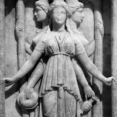

# Hekate

Handles functions and methods to be runned at shutdown.

- Provide priority levels: 1 -high, 2 -normal, 3 -low;
- Perform extended check of callable nature before registration;
- Allow for deregistration;
- Throw exceptions only if asked to;
- Comes with an interface.

Very handy for log buffering, mail piling, database closing, etc.

## Doc

```php
use \SSITU\Hekate\Hekate;

require_once 'path/to/autoload.php';

$throwException = true; # default: false
$Hekate = new Hekate();
// or
$Hekate = new Hekate($throwException);
// and also
$Hekate->setThrowException($throwException);

$priority = 1; #default: 2

# Functions:
$Hekate->register('funcName', ['funcArgm1', 'funcArgm2'], $priority);

# Methods:
$Hekate->register(['className', 'publicStaticMethodName'], ['someMethodArgm'], $priority);
// or use helper:
$Hekate->registerMethod('className', 'publicStaticMethodName', ['someMethodArgm'], $priority);

// Class passed as string can only register static method.
// Otherwise, pass object:
$Hekate->registerMethod(new SomeClass(), 'publicMethodName',  ['someMethodArgm'], $priority);

# Deregister:
$registrationId = $Hekate->register('callable');
$Hekate->deregister($registrationId);

// when exception throwing is turned off: register method will return FALSE in case of invalid callback
$registrationId = $Hekate->register('badCallable');
if($registrationId === false){
    // handle it the way you prefer
}
```

## Contributing

Sure! You can take a loot at [CONTRIBUTING](CONTRIBUTING.md).

## License

This project is under the MIT License; cf. [LICENSE](LICENSE) for details.


